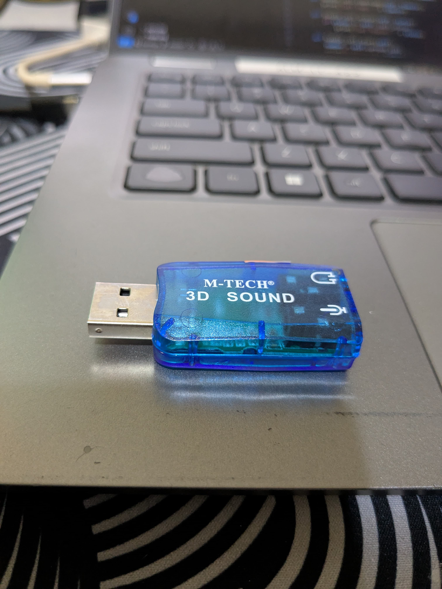
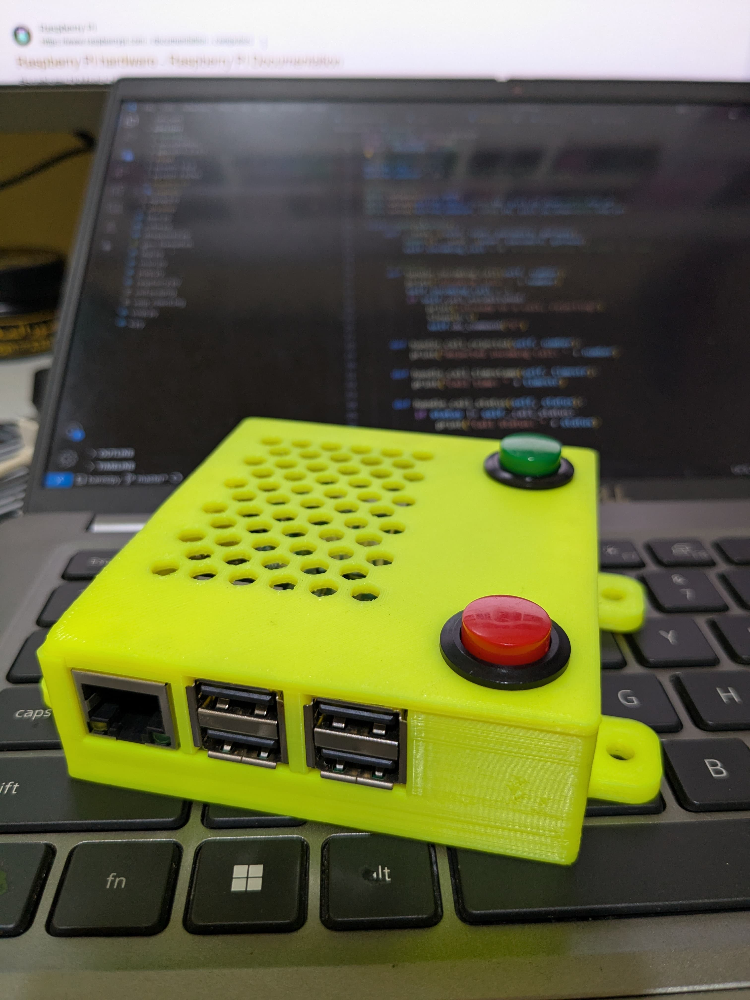

# SIP Client for Rasperry Pi
This repository is used for SIP client implementation using baresip module and python wrapper baresipy, you can use freepbx as the SIP server or anything similar.

For freepbx server installation on debian os you can follow the method in the official documentation or github repository [FreePBX](https://github.com/FreePBX/sng_freepbx_debian_install "freepbx debian install")

## Hardware configuration
Unfortunately, the Raspberry Pi only supports output jacks such as speakers and headphones. You have to add additional input for a microphone such as the USB audio below. The schematic can be seen [here](https://github.com/nurfauziskandar/raspberry-sip-client/blob/main/hardware/images/wiring.png "wiring") 





## Install dependencies
```
sudo apt update
sudo apt install python3-pip
sudo apt install baresip
sudo apt install virtualenv
sudo apt install ffmpeg
sudo apt install git
```

## Clone this repo and create venv
```
git clone https://github.com/nurfauziskandar/raspberry-sip-client.git
cd raspberry-sip-client
virtualenv sipclient
source sipclient/bin/activate
ln -s /usr/bin/ffmpeg sipclient/bin/ffmpeg
```

## Add .env file
rename .env.example to .env and edit it
```
mv .env.example .env
```
```
nano .env
```
```
DIAL_CALL=001,011,012               # For calling another SIP client
USER_DIAL=002                       # For you username
PASSWORD=YourPassword               # Your password
FREEPBX_SERVER=123.193.120.217      # IP or host your server pabx
```

## Install python lib
```
pip3 install -r requirement.txt
```

## Dont forget to set default output on raspi-config.
```
sudo raspi-config
Choose, System Options -> Audio -> bcm2835 Headphones or headphone only
```

## You can run this SIP Client as a service/systemd (optional)
create file on /etc/systemd/system/sipclient.service and paste configuration below, before that you need adjust for own configuration, like a path and user host.
```
sudo nano /etc/systemd/system/sipclient.service
```
```
[Unit]
Description=SIP Client Script as a Service
After=network-online.target sound.target local-fs.target
Wants=network-online.target sound.target

[Service]
User=pi
WorkingDirectory=/home/pi/raspberry-sip-client
ExecStart=/home/pi/raspberry-sip-client/sipclient/bin/python /home/pi/raspberry-sip-client/main.py
Environment="PATH=/home/pi/raspberry-sip-client/sipclient/bin:/usr/local/bin:/usr/bin:/bin"
Environment="PYTHONUNBUFFERED=1"
Restart=always

[Install]
WantedBy=multi-user.target
```

### Note
You can also run this code without venv, if you have an issue, please let me know, you can open an issue or can contact me on iskandar@codezero.id